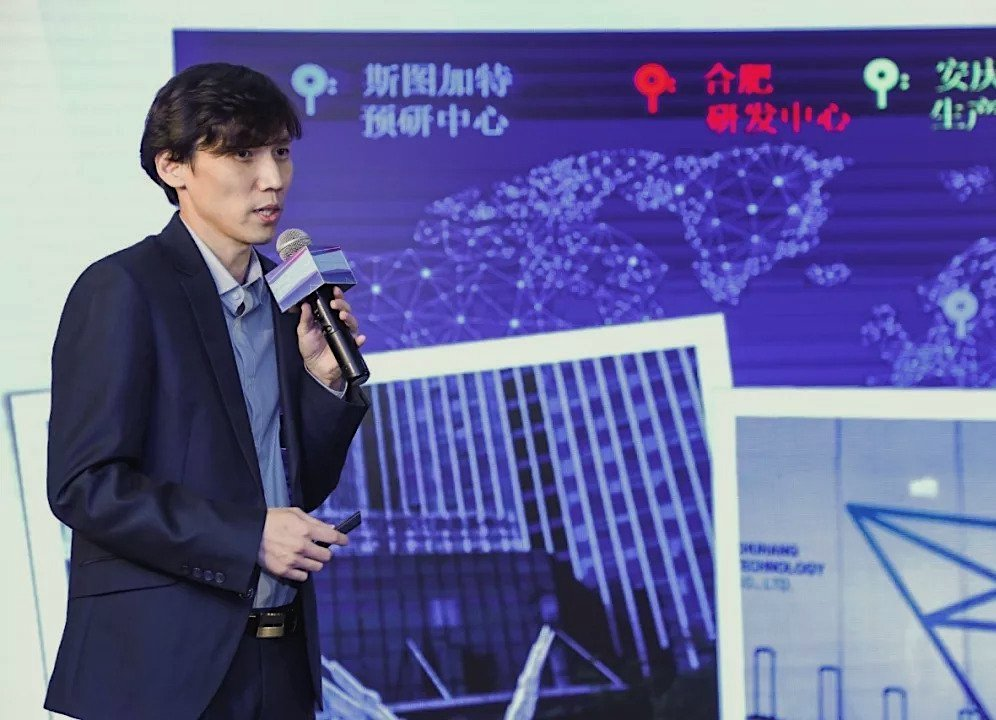
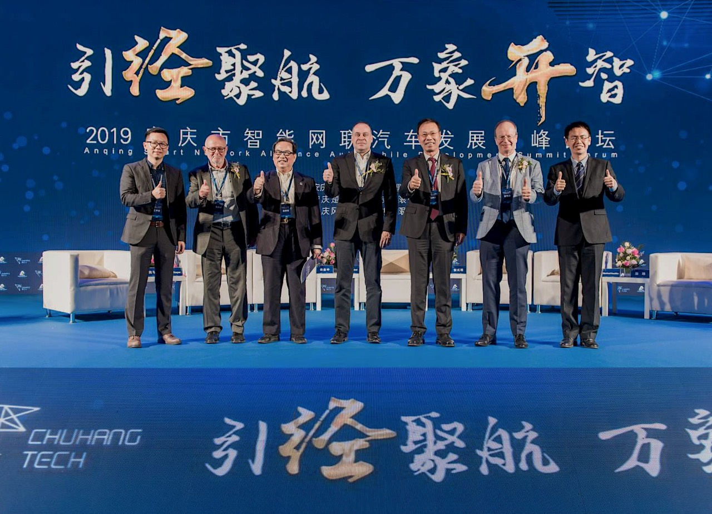

::: slot cover-top-image

:::

::: slot cover-top-title
楚詠焱专访: 用技术填补中国车载雷达行业空白
:::

::: slot cover-top-desc
楚航科技CEO楚詠焱先生凭借“77GHz车载毫米波雷达”项目一路过关斩将，从34个创新创业项目中脱颖而出，成功斩获唯一一名最高奖项一等奖！
:::

::: slot cover-top-link
<a href="/news/news-2019-10-31.html">详细内容</a>
:::

::: slot cover-bottom-image

:::

::: slot cover-bottom-title
2019安庆市智能网联汽车发展高峰论坛举行
:::

::: slot cover-bottom-desc
10月17日上午，由安庆经开区管委会主办、楚航科技公司承办的“引经聚航，万象开智”2019安庆市智能网联汽车发展高峰论坛开幕。
:::

::: slot cover-bottom-link
<a href="/news/news-2019-10-18.html">详细内容</a>
:::

