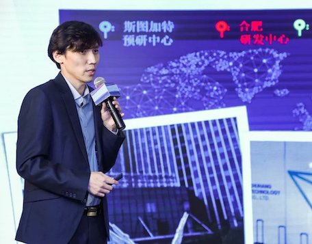
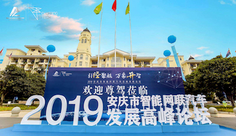
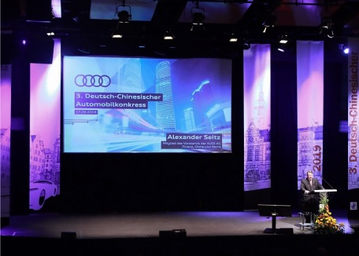
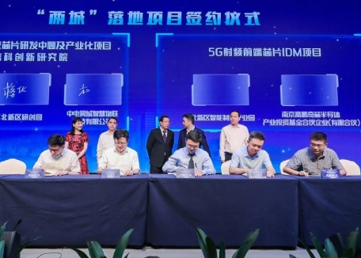
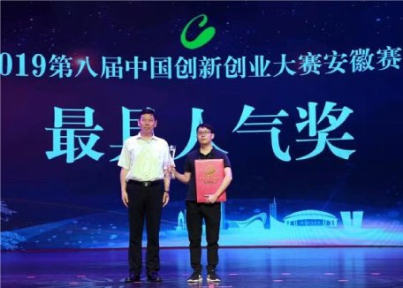
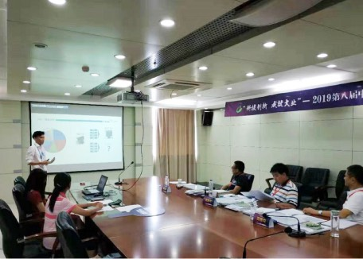
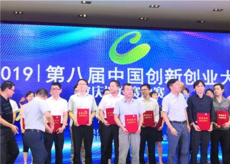
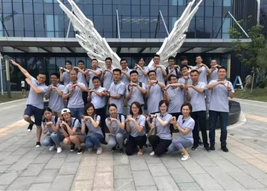

  <!-- begin new content -->

  

    <a href="/news/news-2019-10-31.html">
      <imagelink2>
        专访 | 楚詠焱: 用技术填补中国车载雷达行业空白
        <template v-slot:image>
          

            
          

        </template>
        <template v-slot:text>
  楚航科技CEO楚詠焱先生凭借“77GHz车载毫米波雷达”项目一路过关斩将，从34个创新创业项目中脱颖而出，成功斩获唯一一名最高奖项一等奖！
        </template>
      </imagelink2>
    </a>
  

  

    <a href="/news/news-2019-10-18.html">
      <imagelink2>
        2019安庆市智能网联汽车发展高峰论坛举行
        <template v-slot:image>
          

            
          

        </template>
        <template v-slot:text>
  10月17日上午，由安庆经开区管委会主办、楚航科技公司承办的“引经聚航，万象开智”2019安庆市智能网联汽车发展高峰论坛开幕。
        </template>
      </imagelink2>
    </a>
  

  

    <a href="/news/news-2019-09-28.html">
      <imagelink2>
        楚航科技2020校园宣讲会南京站完美启航
        <template v-slot:image>
          

            
          

        </template>
        <template v-slot:text>
“你的航程, 我最清楚”楚航科技2020校园宣讲会正式启航，南京站火热开展！我们走访了南京理工大学，南京东南大学和南京航空航天大学去寻找我们的“楚航人”！公司以专业的技术实力、完善的发展体系吸引了众多同学的关注，一起来看看南京高校行程和现场精彩瞬间吧。
        </template>
      </imagelink2>
    </a>
  

  

    <a href="/news/news-2019-09-19.html">
      <imagelink2>
        楚航科技受邀前往德国参加中德汽车大会
        <template v-slot:image>
          

            
          

        </template>
        <template v-slot:text>
9月17日，第三届中德汽车大会在因戈尔施塔特拉开序幕。楚航科技代表CTO张我弓先生、中德汽车产业商界高层、政府和科研机构代表超过300人齐聚市立剧院，就中德汽车合作和产业转型趋势进行交流与探讨。
        </template>
      </imagelink2>
    </a>
  

  

    <a href="/news/news-2019-09-18.html">
       <imagelink2>
         楚航科技2020届校园招聘启动
         <template v-slot:image>
           

             
           

         </template>
         <template v-slot:text>
为了让年轻且富有朝气的大学生们更好地融入职场，我们量身订做了“起航”计划（校招人才培养计划），从“职场新人“到“高层管理者/技术专家”提供非常清晰明确的发展通道和职业发展规划。同时，我们将为您提供富有竞争力的薪酬，完善的福利和培训体系，让每一位职场新人赢在起点
         </template>
       </imagelink2>
    </a>
  

  

    <a href="/news/news-2019-09-11.html">
       <imagelink2>
         楚航科技受邀参加江北新区两城计划落地项目签约仪式
         <template v-slot:image>
           

             
           

         </template>
         <template v-slot:text>
楚航科技受邀参加南京江北新区与江苏省股权投资中心战略合作、千亿基金项目、“两城”(芯片之城、基因之城）落地项目签约仪式！
         </template>
      </imagelink2>
    </a>
  

  

    <a href="/news/news-2019-09-04.html">
      <imagelink2>
        楚航科技荣获第八届中国创新创业大赛安徽赛区总决赛省三等奖及最具人气奖
        <template v-slot:image>
          

            
          

        </template>
        <template v-slot:text>
8月28日-29日第八届中国创新创业大赛组织开展了安徽赛区总决赛，楚航科技荣获初创企业组省三等奖及42家参赛企业唯一最具人气奖双项奖项.
        </template>
      </imagelink2>
    </a>
  

  

    <a href="/news/news-2019-08-15.html">
      <imagelink2>
        楚航科技荣获2019年第八届中国创新创业大赛安徽赛区半决赛总分第一名
        <template v-slot:image>
          

            
          

        </template>
        <template v-slot:text>
8月14日-8月15日，在安徽省合肥市科技厅举办2019（第八届）中国创新创业大赛安徽赛区半决赛中，楚航科技荣获电子信息组第一名以及初创企业总分第一名！
        </template>
      </imagelink2>
    </a>
  

  

    <a href="/news/news-2019-08-08.html">
      <imagelink2>
        楚航科技安庆分公司荣获创新创业大赛安庆赛区一等奖
        <template v-slot:image>
          

            
          

        </template>
        <template v-slot:text>
8月2日，由安庆市科技局举办的2019第八届中国创新创业大赛决赛在安庆高新技术创业服务中心隆重举行，楚航科技安庆分公司从进入决赛的25家创新企业中脱颖而出，荣获“C位登场”
        </template>
      </imagelink2>
    </a>
  

  

    <a href="/news/news-2019-08-01.html">
      <imagelink2>
        2019 楚航科技团建 | 凝心聚力，从“心”启航
        <template v-slot:image>
          

            
          

        </template>
        <template v-slot:text>
为庆祝南京公司正式成立，加强南京、合肥、安庆等地分公司团队文化建设，促进团队合作精神与团队凝聚力，2019年7月26日楚航科技组织全体员工开展了以”凝心聚力，从‘心’启航”为主体的团建活动
        </template>
      </imagelink2>
    </a>
  

  <!-- end new content -->

