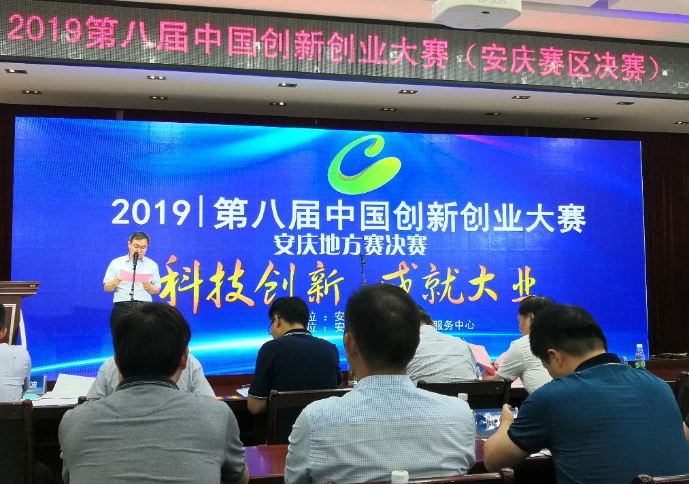

::: slot name
楚航科技安庆分公司荣获创新创业大赛安庆赛区一等奖
:::

*8月2日，由安庆市科技局举办的2019第八届中国创新创业大赛决赛在安庆高新技术创业服务中心隆重举行，楚航科技安庆分公司从进入决赛的25家创新企业中脱颖而出，荣获“C位登场”*

8月2日，由安庆市科技局举办的“科技界规模最高，参赛规模最大的赛区”2019第八届中国创新创业大赛决赛在安庆高新技术创业服务中心隆重举行，楚航科技安庆分公司从进入决赛的25家创新企业中脱颖而出，荣获“C位登场”！

大赛以“科技创新，成就大业”为主题，秉承“政府引导、公益支持、市场机制”的模式，引导、集聚政府和市场资源支持创新创业，进一步激发全社会创新创业热情，扶持中小企业创新创业发展，积极打造大众创业、万众创新的众扶平台，扶持大众创业、万众创新上水平！

<figure>
  
  <figcaption>安庆市副秘书长主持本次大赛</figcaption>
</figure>

<figure>
  
  <figcaption>楚航科技CEO讲述毫米波雷达行业前景市场趋势</figcaption>
</figure>

楚航科技安庆分公司主要生产77GHz车载毫米波雷达，预估安庆工厂一年产能在20万台左右，毫米波雷达在整个市场消费量预估一年5000万台，楚航科技将成为国内第一批量产77GHz车载毫米波雷达。

本次大赛结束后楚航科技将作为冠军企业代表安庆双创企业赴省参赛，正如我们楚航科技CEO所述，楚航科技会在创新创业层面，发挥海外归来的团队优势，并结合国内研发团队与汽车业界人才的力量，努力打破国际垄断，把我们的毫米波雷达做的更好，服务于中国的智能驾驶事业！

<figure>
  
  <figcaption>楚航科技CEO接受安庆电视台采访</figcaption>
</figure>
<figure>
  
  <figcaption>楚航科技CEO接受安庆电视台采访</figcaption>
</figure>

# 毫米波雷达简介
毫米波雷达使用毫米波（millimeter wave 通常毫米波是指30～300GHz频域(波长为1～10mm)的。毫米波的波长介于厘米波和光波之间，因此毫米波兼有微波制导和光电制导的优点。同厘米波导引头相比，毫米波导引头具有体积小、质量轻和空间分辨率高的特点。与红外、激光、电视等光学导引头相比，毫米波导引头穿透雾、烟、灰尘的能力强，具有全天候(大雨天除外)全天时的特点。另外，毫米波导引头的抗干扰、反隐身能力也于其他微波导引头。

