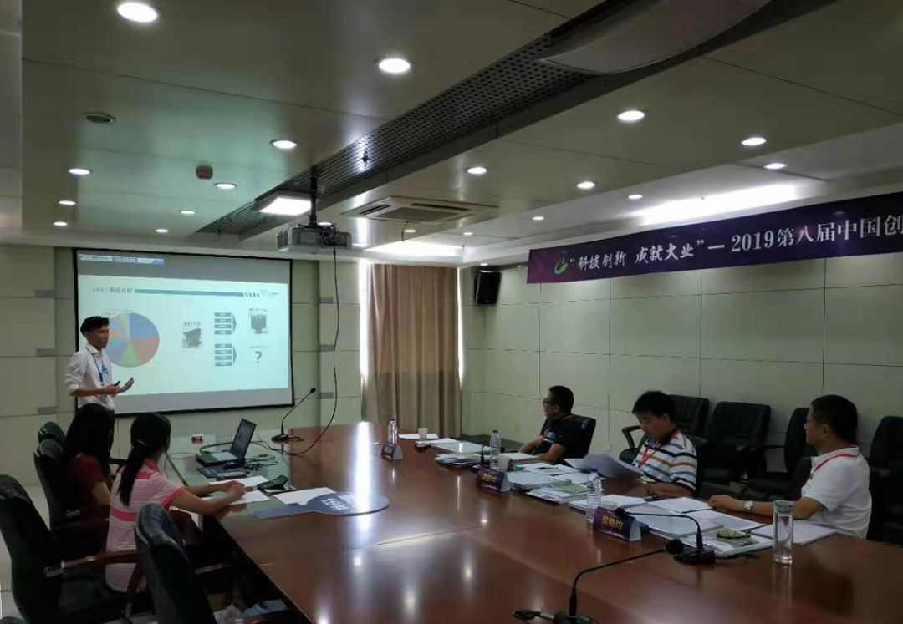

::: slot name
楚航科技荣获2019年第八届中国创新创业大赛安徽赛区半决赛总分第一名
:::

*8月14日-8月15日，在安徽省合肥市科技厅举办2019（第八届）中国创新创业大赛安徽赛区半决赛中，楚航科技荣获电子信息组第一名以及初创企业总分第一名！*

8月14日-8月15日，在安徽省合肥市科技厅举办2019（第八届）中国创新创业大赛安徽赛区半决赛，半决赛初创企业共55家，分为生物医药、电子信息、先进制造、新能源及节能环保、互联网共五组，楚航科技以总分89.67的高分荣获电子信息组第一名以及所有参加半决赛的共55家初创企业的总分第一名！

智能驾驶时代已崛起，ADAS高级驾驶辅助系统进入高速发展时期，楚航科技作为国内第一批量产77GHz毫米波雷达的企业，不仅拥有强大的实力，更有不可估量的发展潜力！
