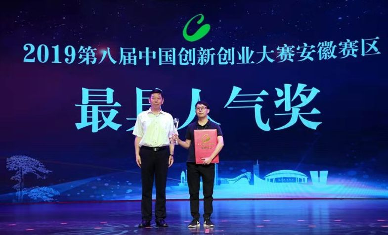
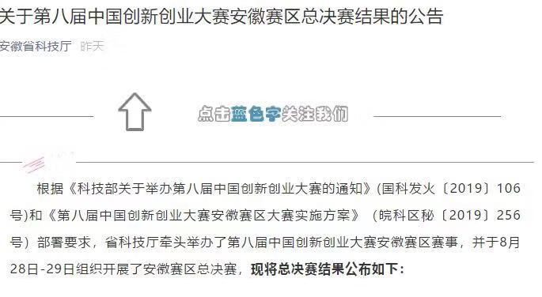
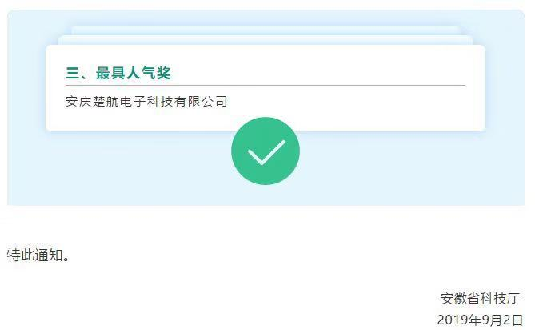

::: slot name
楚航科技荣获第八届中国创新创业大赛安徽赛区总决赛省三等奖及最具人气奖
:::

*8月28日-29日第八届中国创新创业大赛组织开展了安徽赛区总决赛，楚航科技荣获初创企业组省三等奖及42家参赛企业唯一最具人气奖双项奖项！*

根据《科技部关于举办第八届中国创新创业大赛的通知》(国科发火〔2019〕106号)和《第八届中国创新创业大赛安徽赛区大赛实施方案》（皖科区秘〔2019〕256号）部署要求，省科技厅牵头举办了第八届中国创新创业大赛安徽赛区赛事，并于8月28日-29日组织开展了安徽赛区总决赛，楚航科技荣获初创企业组省三等奖及42家参赛企业唯一最具人气奖双项奖项！

安徽省科技厅于9月2日发布了第八届中国创新创业大赛安徽赛区总决赛结果的公告，如下所示：

第八届中国创新创业大赛安徽赛区已经完美落幕，安庆楚航电子科技有限公司将会代表安徽省参加国赛，我们将继续努力，以服务中国的智能驾驶事业为己任、以创新为方向、以完美为信念创造更加美好的智能驾驶未来！

