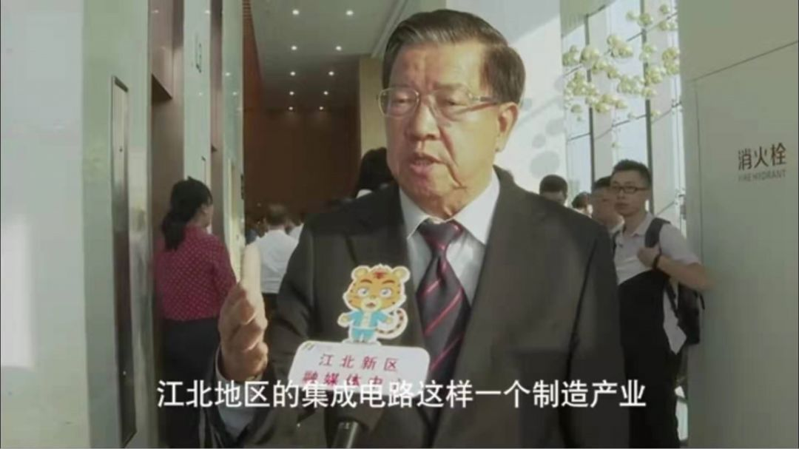

::: slot name
楚航科技参加江北新区两城计划落地项目签约仪式
:::

*楚航科技受邀参加南京江北新区与江苏省股权投资中心战略合作、千亿基金项目、“两城”(芯片之城、基因之城）落地项目签约仪式！*

9月9日，由南京市江北新区管理委员会、南京市地方金融监管局联合主办的“扬子江国际基金街区第一届金融峰会”在扬子江新金融示范区举行。会上，扬子江国际基金街区正式揭牌，楚航科技受邀参加南京江北新区与江苏省股权投资中心战略合作、千亿基金项目、“两城”(芯片之城、基因之城）落地项目签约仪式！

南京副市长冉华，江北新区副主任陈潺嵋，前经贸部副部长、博鳌亚洲论坛秘书长龙永图等领导莅临并发表讲话，会后，龙永图先生在独家采访中提到，目前江北新区集成电路产业的发展，对全国来讲都有巨大的意义！

南京江北新区于日前正式“入群”中国自贸试验区，龙永图部长也强调目前重点发展芯片和集成电路产业，楚航科技也因高技术产业荣获江北新区邀约，成为两城计划（芯片之城、基因之城）项目签约企业！当前国际贸易保护主义面临的最大挑战就是企图切断我们高技术产业产业链，我们会利用自贸区的机遇，打造我们产业链的先进性，维护我们产业的完整性，加强努力，把这件事情做好！

