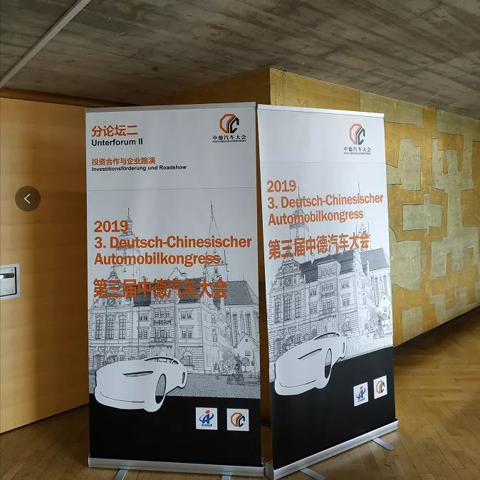

::: slot name
中德汽车大会
:::

楚航科技CTO张我弓先生受邀前往德国参加中德汽车大会

9月17日，第三届中德汽车大会在因戈尔施塔特拉开序幕。楚航科技代表CTO张我弓先生、中德汽车产业商界高层、政府和科研机构代表超过300人齐聚市立剧院，就中德汽车合作和产业转型趋势进行交流与探讨。

奥迪集团董事长亚历山大·塞茨、 戈尔施塔特市市长克里斯蒂安·罗泽尔博士、中国驻德国大使馆经商处王卫东公参、巴伐利亚国务秘书罗兰·维格特、中国商务部投资促进事务局局长刘殿勋分别发表了致辞！

奥迪集团董事长塞茨的专业报告阐述了，在中国，83%的客户愿意购买自动驾驶汽车，他们乐于接受新事物，这与奥迪的DNA是一致的，我们会在中国进行自动驾驶的测试，只有中国愿意与我们分享数据，在中国市场的成功合作经验，将帮助奥迪更好地走向全球市场；

这与我们楚航科技公司的理念非常吻合，楚航科技一直致力于服务中国的智能驾驶事业，努力打破国际垄断，创造更加美好的智能驾驶未来！

张我弓先生个人简介:
楚航科技CTO张我弓先生毕业于斯图加特大学，获得半导体工程博士，十数年工作经验，主导德国博世3代雷达天线设计，负责柏林IHP120GHz射频开关和80GHzAiP项目，资深射频专家，发表了20余篇专业论文。

