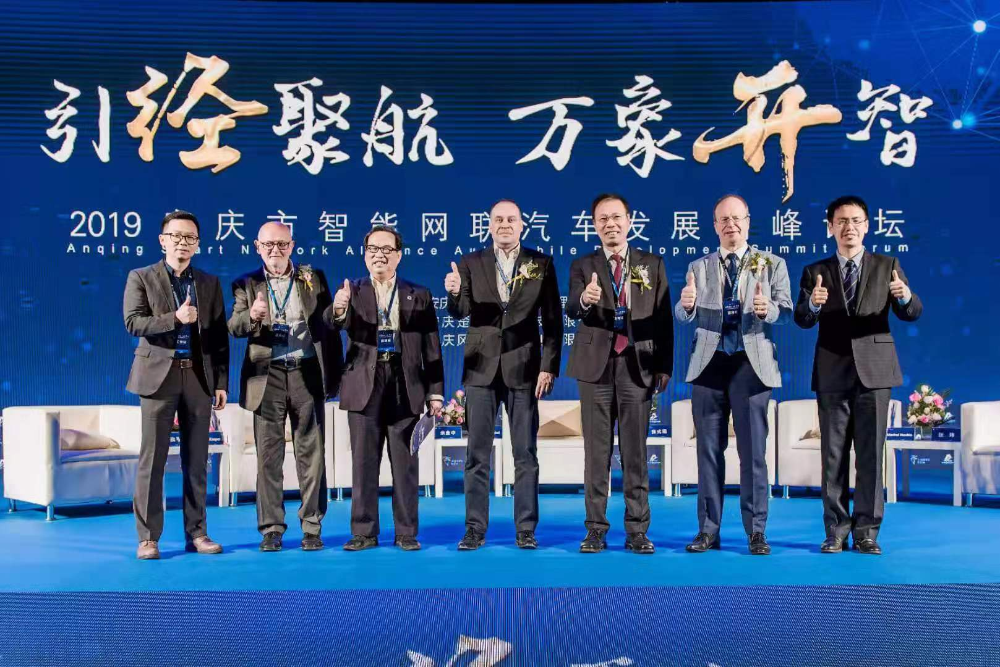

::: slot name
2019安庆市智能网联汽车发展高峰论坛举行
:::

*引经聚航 万象开智*

 
 

10月17-18日，由安庆经开区管委会主办、南京楚航科技有限公司全资生产基地安庆楚航电子科技协办的2019安庆市智能网联汽车发展高峰论坛成功举行并圆满结束。17日上午的论坛开幕式上，市人民政府副市长花家红，市经开区党工委书记、管委会主任吴三九，市科技局局长吴曙等出席。楚航科技CTO张我弓博士作了开场报告，介绍了楚航科技如何依托高效率的研发团队利用稳步迭代的产品样件在短短一年内完成从天使轮数百万人民币到A轮数百万美金的顺利承接。

论坛技术部分邀请到了楚航科技首席科学家德国斯图加特大学Kasper教授、中国科学院半导体研究所，中国科学院大学余金中教授、合肥工业大学机械与汽车工程学院院长钱立军教授、南京航空航天大学电子信息院周建江教授，东南大学机械工程学院殷国栋教授，西安电子科技大学王敏教授，江苏省产业技术研究院感知技术研究所所长岳玉涛博士、德国华人机电工程师协会主席张式程博士，德国 IMST 公司副总裁Henkel先生、泰康利公司全球销售总监Huschka先生等国内外知名专家、学者参加并发表主题演讲。国内智能网联及自动驾驶产业链如天瞳威视、文远知行、豫北转向等头部企业；芯片生产及测试和设备供应商恩智浦、加特兰微电子、香山微波、罗德施瓦茨、雷驰瑞泰、合微电子、导远电子、松下材料等均都参加了此次论坛的详细技术分享。

在论坛的圆桌会议上，楚航科技CTO张我弓博士分别请六位和德国有关的嘉宾分享了自己对于中德汽车工业交流的心得。中国商务部投资促进局汽车产业负责人张玮先生一个月前刚参加了于德国奥迪总部所在地因戈尔施塔特举办的第三届中德汽车大会。他从政策导向和跨国产业融合促进的层面分析了国家商务部对于加强中德汽车工业整个产业链互通有无的必要性和重要性并肯定了这次论坛举办的高规格和实际意义。泰康利全球销售总监Manfred Huschka先生是个中国通，他用易懂的中文点明了高频板材在汽车电子特别是射频传感器领域的重要性，并且十分乐观地坚信楚航科技将会成为国产车载77 GHz毫米波雷达传感器的头部企业。德国华人机电工程师协会主席张式程博士用自己创立该协会的亲身经历直观地阐明了该如何更有效地利用行业协会来整合工程师资源，以推动中德汽车工业技术层面的有效融合。德国著名芯片设计公司IMST副总裁Frank Henkel先生因工作关系经常来中国。他直接地表达了只有互通有无，继续加强中德合作才能增进两国人民的互相了解从而实现文化、技术等多个维度的深度融合，实现命运共同体的目标。中科院半导体所，中国科学院大学余金中教授分享了自己在德国斯图加特大学做访问学者的经历。他着重描述了跟德国学者沟通时，如何做到求同存异达到优势互补的心得体会，并且一针见血地指出： 无论中德，人才融合产生的效益远大于因为彼此不能坦诚相待而带来的恶性竞争。最后楚航科技首席科学家斯图加特大学Erich Kasper教授从技术角度预测了车载传感器将往更高频率（亚太赫兹）更小体积和功耗的发展方向，并且相信随着科技的发展，柔性材料上的共形大阵列天线技术将大幅度提高车载雷达的探测范围和性能。

安庆市经开区领导和与会嘉宾在楚航科技COO李烜的陪同下参加了楚航科技安庆工厂厂房的剪裁仪式并参观了中国首条全自动、多自由度、悬臂式车载77/79 GHz毫米波雷达量产标定线。该标定线对标国外同行业最高水平，并且还兼容六种毫米波雷达产线标定模式。真正用实际行动体现了楚航科技追求全球同行业领先的信念。
论坛外场展示环节，楚航科技还演示了和兄弟公司天瞳威视以及文远知行合作改装的无人车部分功能，使嘉宾和现场观众能够直观感受到毫米波雷达、视觉摄像头及超声波雷达融合完成一定工况下的智能驾驶。

楚航科技CEO楚咏焱于论坛期间在上海参加了“2019上海海归人才创业大赛＂并喜获一等奖。

