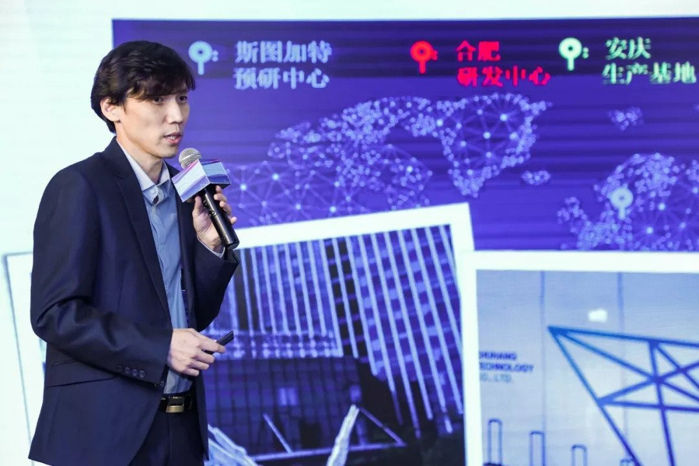

::: slot name
专访 | 楚詠焱: 用技术填补中国车载雷达行业空白
:::

*楚航科技CEO楚詠焱先生凭借“77GHz车载毫米波雷达”项目一路过关斩将，从 34 个创新创业项目中脱颖而出，成功斩获唯一一名最高奖项一等奖！*

 
 

<figure>
  
  <figcaption>楚航科技CEO楚詠焱获颁“2019上海海归人才创业大赛＂一等奖</figcaption>
</figure>

10月19日，2019年中国海归创业大会暨第七届上海海归人才创新创业大会在上海隆重举行。海归人才创业大赛作为大会当天重要环节，参赛项目涵盖人工智能、设备制造、智慧生活等前沿科技领域。楚航科技CEO楚詠焱先生凭借“77GHz车载毫米波雷达”项目一路过关斩将，从34个创新创业项目中脱颖而出，成功斩获唯一一名最高奖项一等奖！全场评委对楚航科技在智能驾驶领域的成就表示赞赏！

自2013年开始，“上海海归人才创新创业大会”已连续举办六届，是目前上海举办时间最早、参与人数最多、在海归人才中最具影响力的创新创业重要活动。今年大会是在中共上海市委组织部、上海市委统战部的指导下，由上海市欧美同学会（上海市留学人员联合会）、中共上海市长宁区委员会、上海市长宁区人民政府共同主办。大会以“奋斗新时代，海创新未来”为主题，紧扣国家战略。

 

<figure>
  
  <figcaption>楚航科技CEO楚詠焱</figcaption>
</figure>

*楚航科技创始人兼CEO楚詠焱曾旅德20年，是亚琛工大电子信息硕士，南德认证10年经验的功能安全专家，在德国博世集团有13年研发管理经验。2018年初，楚詠焱带领团队回国创业。团队成员拥有国内外著名大学博士、硕士学历以及十年以上的国际一流汽车零部件供应商、整车厂研发管理经验。*

对于一家企业来讲，创办楚航科技一切从 0 开始，但是对于研发技术来讲，则是团队厚积薄发的专业释放。如今，经过近两年快速发展，公司已成为集研发、销售、生产和服务于一体的高科技创新型企业，并在中德各地设立多家子公司。

楚航科技从创业之初到获得2019年上海海归人才创业大赛一等奖。活动现场，观察者网邀请楚航科技创始人兼CEO楚詠焱进行专访。这期间团队是怎么做到的？经历了怎样的过程？以及开发研制的基于77GHz毫米波雷达的智能驾驶系统对中国而言有着怎样的意义？

以下回答，来自观察者网记者陈兴华对楚詠焱先生专访。

 
 

**关于选择回国创业的原因**

楚詠焱：

其实早在德国，我们就有要做点事情的想法，不一定算创业，我们在德国做过公益性质的中文学校。另一方面，德国跟美国、澳大利亚相比一个很大的特点，就是培养了我做事情谨慎的态度，所以这么多年我一直在找机会、找团队。如今正好遇到对的伙伴，大家就决定一起回国做一些有意义的事情。

这次大赛培训时曾有一个问题：你觉得创业是一道选择题还是一道必做题？对我来说，创业是一道填空题。我在德国早就把一个个空格留好。现在，市场、资金和团队等方面都填完之后，我们有了大展拳脚的舞台，也希望用自己的能力，帮助填补中国汽车行业的某些空白。

我在德国工作了13年，学到了很多东西。我觉得应该是学以致用的时候了，接下来就要去做一点自己想做的事情。

 

**关于国内车载雷达的市场看法**

楚詠焱：

之前国内车载雷达行业出于各种原因，基本上是空白。而这两年，中国汽车市场蓬勃发展，创造了这个机遇。我们可以凭借自身多年来累积的一些经验，用在能落到实处的某些应用上去。

中国肯定是全球潜力最大的市场，有危也有机，只要敢做，不能说一定会成功，但至少会有些推动作用，也可以给后来者一些经验教训。现在车载雷达这块，中国汽车标准化技术委员会正在制定相关标准。可以看出，政府以及一些行业联盟，也希望来规范市场，让市场有序的发展。

 

<figure>
  
  <figcaption>图源：OFweek智能汽车网</figcaption>
</figure>

 

**关于创业公司城市选择**

楚詠焱：

选择过程有很多波折，我们也走了很多弯路，但都是朝着既定的目标前进。刚回国时，很多人都会问我一个问题，为什么第一步选择合肥？因为我本身是上海人，我太太也是上海人，合伙人都是湖北的，那为什么选择合肥？

实际上，我们在创业上看得比较远，首先要找一个好的起步点。如果选择上海，势必要将资金过多投入到研发之外的场地、人员等成本上，这和我们前期致力于研发的目标相冲突。所以我们选择了一个符合前期设想的起步点。

在合肥有丰富的高校资源，我们通过一年的时间，打造起核心的研发团队，包括打磨好产品的核心功能。作为以产品为核心的制造行业，我们不能一上来就心浮气躁的去主战场，直接进入当中厮杀，而是选择有节奏的发展，接着再开始往南京、往上海扩建团队，进行市场的探索。

 

**关于获奖项目目前在国内或国际上水平**

楚詠焱：

在国际上，现在只有四家在做毫米波雷达，就是通常所说的“ABCD”——奥托立夫（Autoliv）、博世（Bosch）、大陆（Continetal）和德尔福（Dephi）。其它大多在77GHz技术上探索，虽然国内有很多企业在做，但是没有一家能够像“ABCD”那样能真正意义上的实现量产。

所以说，我们的目标就是成为第一批量产的国产雷达。我们已经准备好量产的产线，预计在明年中可以实现小批量试生产，而且在产品技术水平、指标、质量、可靠性等方面都要和“ABCD”对标。

 

<figure>
  
  <figcaption>
10月17日，安庆市经开区领导在楚航科技COO李烜的陪同下参加了楚航科技安庆工厂厂房的剪裁仪式并参观了中国首条全自动、多自由度、悬臂式车载77/79 GHz毫米波雷达量产标定线。
  </figcaption>
</figure>

 

**关于楚航科技产品自主研发以及团队的优势**

楚詠焱：

我们团队技术人员虽然是有德国背景，但除了担任公司顾问的教授外，其他都是中国人，公司的重心也在中国。

在车载行业除了要有顶尖技术，更重要的是累积，包括一些实用的大规模验证，这是我们国家在这个行业中比较欠缺的。国内77GHz毫米波雷达技术是两年前才开始的，也就是说最长只累积了两年的经验，而欧洲已经累积了15年。当中有些坑，别人都已经踩过了，但国内现在还在不停的踩。

我们团队的优势除了在技术上比竞争对手要好以外，团队成员基本上都有5到10年甚至10年以上的行业工作经验，最大的优势是了解发展路线然后避免一些“坑”，缩短整个研发周期中的试错期。

怎样能把一个雷达做到又好又便宜又稳定？怎样与主机厂合作提高车辆安装的满意度？这些问题，是我们比较擅长的地方。

 

**关于看待和国内一些初创企业的竞争和差别**

楚詠焱：

我觉得大家都是各有所长。我们从一开始就定下了以做产品为核心的原则，而不是仅仅做一个样品。

在最初设计产品的时候，我们就以量产20万个雷达作为目标，而不是只生产一个雷达，所以在研发流程和方法上存在很大的区别。

 

**关于目前公司在产品商用合作上的进展**

楚詠焱：

我们的产品现在已经完成B样的所有研发工作，与合作伙伴进行了测试，可以满足他们的大部分需求。迭代一版C样，也已经做了认证测试，并且做好了进入量产前的准备。另外，我们目前已经跟部分主机厂和一级供应商取得良好沟通，也达成了合作意向。

 

<figure>
  
  <figcaption>
2019年1月，搭载由楚航科技研发的77GHz毫米波雷达的江淮IEV电动车在安庆江淮电动车生产基地完成首次路测。
  </figcaption>
</figure>

 

**关于毫米波雷达的应用场景和行业前景**

不管车载行业发展到什么阶段，我觉得毫米波雷达都会有一席之地。因为无论一辆汽车上使用多少其他传感器，都至少要装一个毫米波雷达。

激光雷达虽然精度高，但是容易受到雾霾影响；摄像雷达通过镜头分辨可以“看见”，但是容易受到黑夜影响；而毫米波雷达是这么多传感器当中唯一一个可以全天候性工作的，不管是黑夜或者是雾霾，任何情况下的目标都能看到。此外，它可以很快、很准确的探测到距离，速度和方位等信息，价格也比激光雷达要便宜一些。

另外，每个雷达都有它的长处和短处，我觉得将来的发展趋势应该是多传感器的融合。车载最重要的一个特性就是一定要安全，我做了功能安全这么多年，觉得没有可能只是一个单独的传感器去支撑整个自动驾驶系统。谈自动驾驶只谈一个传感器，是一个伪命题。

至于用怎样的传感器来实现融合，是每家汽车公司的发展战略和方向问题。不过，无论什么样的策略、方向，我建议至少得放一颗毫米波雷达，去避免一些场景下面的部分盲点或者缺陷。

 

**关于毫米波雷达和5G在自动驾驶上协同**

楚詠焱：

我觉得5G通讯是一个接口通道，毫米波雷达是一个传感器，它搜集到的数据和信号，都可以通过5G去传给云端，传给别的车或者终端，做一个车路协同，或者车车协同的工作。这是一个数据共享，也是所有传感器将来都想发展的一个方向。

 

**关于公司未来的发展定位和目标**

楚詠焱：

上市是每个创业者都在想的问题，但不是我们的终极目标。我们的目标想做成国内毫米波雷达、智能辅助驾驶系统的佼佼者。不仅在技术上做到国内领先，更重要的是把产品质量能做到德国的水平，甚至超越它，增加中国在车载行业的话语权。

中国现在还没有一家能够真正概览大局的一级供应商，单靠一家企业也无法在短期内做到这种规模。我们是想集中精力，把其中一块自己擅长的部分做好，然后大家联合起来，做一个“大一级供应商”。联合国内一些企业一起把整个生态链搭起来，能够做成比较强的国产供应商，产品能跟国际主流产品相抗衡。

 

**关于20年前后国内变化**

楚詠焱：

跟20年前比，现在肯定是天翻地覆的变化。20年前我还是同济大学汽车与拖拉机系的学生，从系的名字也能听出当时中国汽车行业的状况，但到现在已经发生了焕然一新的巨大变化。当时，我们也从来没有听说过周围的人要创业，或者那时还叫个体户。

然而，现在是国家大力提倡大众创业、万众创新，基本上有想法、有能力的人都能出来做自己想做的事情。正是因为这些原因，这几年中国的发展确实惊艳了全世界，尤其在互联网领域。我觉得国内目前有着相当好的政策、平台和市场机遇。

中国在互联网、车联网等行业的发展走到了世界前列。我们现在去德国买东西还都得付现金，相当不方便、不习惯。这也等于说一个整体的市场环境，创业还是需要环境的。另外，中国政府对创业的大力支持，扶持力度在全世界都是绝无仅有的。

